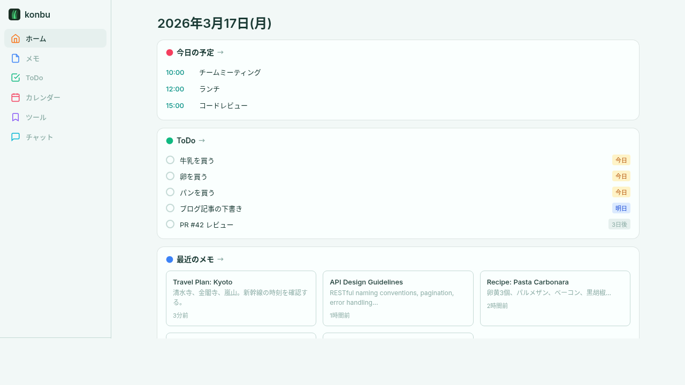
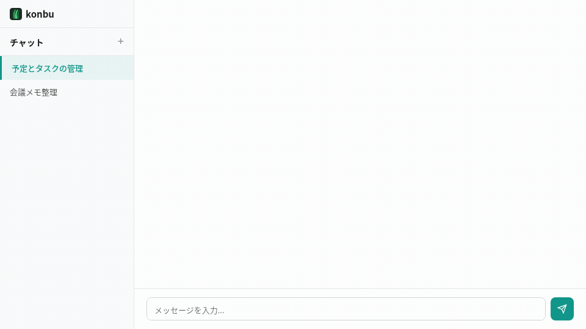

<p align="center">
  
</p>

<h1 align="center">konbu</h1>

<p align="center">電子版AI組み込みスケジュール帳。<br>予定を軸に、メモやToDoも同じ場所で扱える。</p>

<p align="center">
  <a href="LICENSE"></a>
  <a href="https://github.com/krtw00/konbu/actions"></a>
</p>

<p align="center">日本語 | <a href="README.md">English</a></p>

<p align="center"></p>

<p align="center"></p>

---

## 使ってみる

- **クラウド版** -- [konbu-cloud.codenica.dev](https://konbu-cloud.codenica.dev) ですぐに使えます（無料・登録のみ）
- **セルフホスト** -- Docker で自分のサーバーに構築（下記参照）

## なぜ konbu を作ったのか

スケジュール帳は予定を見るには便利ですが、関連するメモややることは別アプリに逃げがちです。

- 予定はカレンダー
- メモは Notion や Obsidian
- タスクは ToDo アプリ
- URL はブラウザのブックマーク

予定の周辺情報が散らばると、あとで見返すたびに「どこに置いたか」を探すことになります。

konbu は、予定を軸にまわりの情報もまとめて扱える電子版AI組み込みスケジュール帳です。予定、メモ、ToDo、リンクを同じ場所に置いて、あとから迷わず見返せるようにしています。

カレンダーはふつうに使えて、メモやToDoはその周辺に置けます。AI はその情報空間に対して動く代理人で、予定確認、検索、整理、書き直し、登録まで手伝います。

## 機能

- **横断検索** -- メモ・ToDo・予定・ブックマークをまたいだ全文検索。「あれどこだっけ」がなくなる
- **AI エージェントチャット** -- 「明日の予定を教えて」「買い物リストを ToDo に追加」— AI が検索・整理・書き直し・操作を代行（無料枠あり）
- **メモ** -- Markdown対応、ライブプレビュー、タグ管理
- **ToDo** -- インライン作成、期限設定、タグフィルタ、ノート付き
- **カレンダー** -- 月表示、予定の作成・編集、iCalインポート
- **ツール** -- サイト管理、カテゴリ分類、ドラッグ&ドロップ並び替え
- **CLI & MCP** -- CLIクライアントとMCPサーバーでAIエージェント連携
- **エクスポート/インポート** -- JSON・Markdown ZIP出力、iCal取り込み
- **多言語対応** -- 日本語・英語

## クイックスタート

```bash
cp .env.example .env
docker compose up -d
```

`http://localhost:8080` を開いてアカウントを作成します。開発用composeでは `DEV_USER=dev@local` が設定されており、登録なしで利用できます。

### 本番環境（Traefik連携）

```bash
# .env にドメインとパスワードを設定して起動
docker compose -f docker-compose.prod.yml up -d
```

### ネイティブ（Docker不要）

```bash
# 前提: Go 1.25+, Node.js 22+, PostgreSQL 16+

# フロントエンドビルド
cd web/frontend && npm ci && npm run build && cd ../..

# サーバービルド
go build -o bin/server ./cmd/server

# 起動（全マイグレーションは起動時に自動適用）
DATABASE_URL="postgres://..." SESSION_SECRET="..." ./bin/server
```

## 設定

| 変数 | 必須 | デフォルト | 説明 |
|---|---|---|---|
| `DATABASE_URL` | Yes | -- | PostgreSQL接続文字列 |
| `SESSION_SECRET` | Yes | 開発用フォールバック | セッション署名キー |
| `PORT` | No | `8080` | サーバーポート |
| `DEV_USER` | No | -- | 開発用自動ログイン（メール形式） |
| `OPEN_REGISTRATION` | No | -- | `true` で誰でもアカウント作成可能（Cloud版向け） |
| `BASE_URL` | No | -- | OAuth コールバックに使う公開URL |
| `GOOGLE_CLIENT_ID` | No | -- | Google OAuth ログイン有効化 |
| `GOOGLE_CLIENT_SECRET` | No | -- | Google OAuth ログイン有効化 |
| `WEBHOOK_SECRET` | No | -- | GitHub Sponsors Webhook シークレット |
| `KOFI_TOKEN` | No | -- | Ko-fi Webhook 検証トークン |
| `GITHUB_FEEDBACK_TOKEN` | No | -- | 匿名化したフィードバックを GitHub issue 化するためのトークン |
| `GITHUB_FEEDBACK_REPO` | No | -- | フィードバックを送るリポジトリ。例: `krtw00/konbu` |
| `GITHUB_FEEDBACK_LABELS` | No | -- | issue に付けるカンマ区切りラベル |
| `AI_ENCRYPTION_KEY` | No | -- | BYOK 用 AI キー暗号化に使う64桁hex |
| `DEFAULT_AI_PROVIDER` | No | `openai` | サーバー提供の無料枠 AI プロバイダ |
| `DEFAULT_AI_API_KEY` | No | -- | サーバー提供の無料枠 AI キー |
| `DEFAULT_AI_ENDPOINT` | No | -- | 無料枠プロバイダ endpoint 上書き |
| `DEFAULT_AI_MODEL` | No | -- | 無料枠モデル上書き |
| `R2_ACCESS_KEY_ID` | No | -- | 添付ファイル保存用資格情報 |
| `R2_SECRET_ACCESS_KEY` | No | -- | 添付ファイル保存用資格情報 |
| `R2_ENDPOINT` | No | Cloudflare R2 既定値 | 添付ファイル保存先 endpoint |
| `R2_BUCKET` | No | `konbu-attachments` | 添付ファイル保存先バケット |
| `R2_PUBLIC_URL` | No | -- | 添付ファイル公開ベースURL（任意） |

### Docker Compose（本番用）変数

| 変数 | 説明 |
|---|---|
| `POSTGRES_PASSWORD` | PostgreSQLパスワード |
| `KONBU_DOMAIN` | Traefik TLSルーティング用ドメイン |

## CLI

CLIはリモートのkonbuサーバーにAPI経由で接続するスタンドアロンクライアントです。サーバーのコードはCLIバイナリに含まれません。

```bash
go install github.com/krtw00/konbu/cmd/konbu@latest
```

### セットアップ

```bash
# 環境変数を設定（~/.zshrc 等に追記推奨）
export KONBU_API=https://konbu.example.com
export KONBU_API_KEY=your-api-key

# フラグでも指定可能
konbu --api https://... --api-key your-key memo list
```

APIキーはWeb UIの **設定 > セキュリティ** で発行できます。

### コマンド一覧

全コマンドで `--json` フラグを使うと機械可読なJSON出力になります。

```
konbu memo list                        # メモ一覧
konbu memo show <id>                   # メモ内容を表示
konbu memo add "タイトル" -c "内容"     # メモ作成（-c - で標準入力）
konbu memo edit <id> --title "新名"    # メモ更新
konbu memo rm <id>                     # メモ削除

konbu todo list                        # ToDo一覧
konbu todo show <id>                   # ToDo詳細
konbu todo add "タスク" -t "tag1,tag2" # ToDo作成
konbu todo add "タスク" -d 2025-04-01  # 期限付きで作成
konbu todo edit <id> --desc "メモ"     # ToDo更新
konbu todo done <id>                   # 完了にする
konbu todo reopen <id>                 # 未完了に戻す
konbu todo rm <id>                     # 削除

konbu event list                       # 予定一覧
konbu event show <id>                  # 予定詳細
konbu event add "タイトル" -s <RFC3339> # 予定作成
konbu event edit <id> --title "新名"   # 予定更新
konbu event rm <id>                    # 削除

konbu tool list                        # ツール一覧
konbu tool add "名前" "https://..."    # ツール追加
konbu tool edit <id> --category "開発" # ツール更新
konbu tool rm <id>                     # 削除

konbu tag list                         # タグ一覧
konbu tag rm <id>                      # タグ削除

konbu search "検索語"                  # 横断検索

konbu api-key list                     # APIキー一覧
konbu api-key create "キー名"          # APIキー作成
konbu api-key rm <id>                  # APIキー削除

konbu export json -o backup.json       # JSONエクスポート
konbu export markdown -o backup.zip    # Markdown ZIPエクスポート
konbu import ical calendar.ics         # iCalインポート
```

IDは先頭8文字の短縮形で指定できます。

## API

ベースパス: `/api/v1`

| リソース | エンドポイント |
|---|---|
| 認証 | `POST /auth/register`, `POST /auth/login`, `POST /auth/logout`, `GET /auth/setup-status`, `GET /auth/providers`, `GET /auth/google/login`, `GET /auth/google/callback` |
| ユーザー | `GET/PUT /auth/me`, `GET/PUT /auth/settings`, `POST /auth/change-password`, `POST /auth/delete-account` |
| APIキー | `GET/POST /api-keys`, `DELETE /api-keys/:id` |
| メモ | `GET/POST /memos`, `GET/PUT/DELETE /memos/:id`, `GET/POST /memos/:id/rows`, `POST /memos/:id/rows/batch`, `GET /memos/:id/rows/export`, `PUT/DELETE /memos/:id/rows/:rowId` |
| ToDo | `GET/POST /todos`, `GET/PUT/DELETE /todos/:id`, `PATCH /todos/:id/done`, `PATCH /todos/:id/reopen` |
| 予定 | `GET/POST /events`, `GET/PUT/DELETE /events/:id` |
| カレンダー | `GET/POST /calendars`, `GET/PUT/DELETE /calendars/:id`, `POST /calendars/join/:token`, 共有リンク・メンバー管理, `GET /calendar.ics` |
| ツール | `GET/POST /tools`, `PUT/DELETE /tools/:id` |
| タグ | `GET/POST /tags`, `PUT/DELETE /tags/:id` |
| 検索 | `GET /search?q=...` |
| チャット | `GET/POST /chat/sessions`, `GET/PUT/DELETE /chat/sessions/:id`, `POST /chat/sessions/:id/messages`, `GET/PUT /chat/config` |
| 添付ファイル | `POST /attachments`, `GET /attachments/*` |
| エクスポート | `GET /export/json`, `GET /export/markdown` |
| インポート | `POST /import/ical` |

## 開発

```bash
# PostgreSQL起動
docker compose up -d postgres

# フロントエンド開発サーバー
cd web/frontend && npm run dev

# サーバー起動
DEV_USER=dev@local go run ./cmd/server

# CLIビルド
go build -o bin/konbu ./cmd/konbu

# テスト
go test ./...
```

### ディレクトリ構成

```
cmd/
  server/       # APIサーバー
  konbu/        # CLIクライアント
internal/
  handler/      # HTTPハンドラ
  service/      # ビジネスロジック
  repository/   # DBアクセス (sqlc)
  middleware/   # 認証・ログ
  client/       # APIクライアント（CLI用）
  mcp/          # MCPサーバー
web/frontend/   # React + Vite SPA
sql/            # スキーマ・マイグレーション
docker/         # Dockerfile
```

## Roadmap

- リマインダー通知（メール・ブラウザ）
- スマホUI改善
- CI テスト追加
- AIチャット強化（コンテキスト改善、新モデル対応）

## スポンサー

konbuが役に立ったら、[スポンサー](https://github.com/sponsors/krtw00)でプロジェクトを支援できます。

## ライセンス

[MIT](LICENSE)
