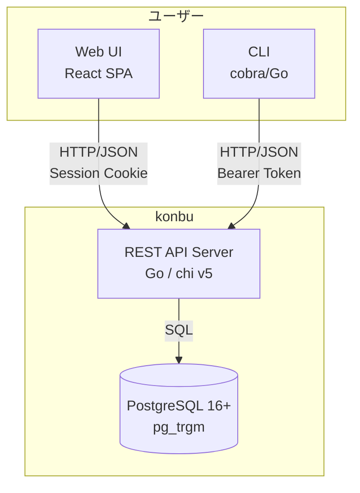

# プロジェクト概要

> **Status**: Active | 最終更新: 2026-05-21
>
> 骨子の正本は [concept.md](./concept.md)。本ドキュメントはその概要版。

本ドキュメントは、konbu全体を1枚で把握するための概要を記載する。

---

## 一言で言うと

konbuは、**AI 執事が世話してくれる、自分だけのデジタルシステム手帳**である。メモ・ToDo・予定・テーブルを1冊に綴じ、横断して引ける。表の顔はシステム手帳、中身のエンジンは AI / MCP / CLI。他人とは共有しない個人専用の一冊で、外部（Google カレンダー等）からは取り込むが、外には漏らさない。セルフホスト（OSS・MIT）とクラウド版の2形態で提供する。

---

## 背景

| 項目 | 内容 |
|------|------|
| 現状の課題 | メモ・ToDo・カレンダーが別々のサービスに散らばり、「どこにあるか」を覚えるコストが発生する。Notionは重く、Obsidianは表現がMarkdownに寄りやすく、Google Calendarはデータを手元に置きづらい |
| 解決アプローチ | システム手帳のように「1冊に綴じて横断して引く」を前提に、個人の情報を単一の手帳に集約する。メモ・ToDo・予定・テーブルを分断せず、REST API を窓口に Web UI・CLI・AI 執事を含むすべてのクライアントからアクセス可能にする |

---

## 主要機能

| 機能 | 説明 |
|------|------|
| Memos | Markdown/テーブル型のメモ。CodeMirror 6エディタ、タグ付き |
| ToDo | 期限・タグ・メモ付きタスク管理。完了/未完了のステータス操作 |
| Calendar | 月表示カレンダー。終日/時間指定、繰り返し予定、iCalインポート（個人専用・owner-only） |
| Cross-search | メモ・ToDo・予定・テーブルをまたいだ横断全文検索（pg_trgm） |
| AI Agent Chat | 手帳を前提に、自然言語で検索・整理・添削・操作を委譲する執事 |
| CLI | 全リソースのCRUD操作を備えたスタンドアロンCLIクライアント |
| Export/Import | JSON/Markdown ZIPエクスポート、iCalインポート |

---

システム手帳という"物"の性質を設計軸にする（詳細は [concept.md](./concept.md) の判定基準）。

- **リフィル式**: 必要なページ（メモ・ToDo・予定・テーブル）だけ自分で綴じる
- **一冊集約**: 全部そこにあり、横断して引ける
- **個人専用**: 他人と共有しない自分だけの一冊。1アカウント = 1冊
- **スケジュールが背骨**: 時間軸（マンスリー/ウィークリー/デイリー）が中心
- **inbound / outbound 原則**: 外（Google カレンダー等）からは取り込むが、外には一切漏らさない
- **AIは執事である**: AIは主役ではなく、手帳を書く・引くための実行レイヤーとして設計する

---

## 対象ユーザー

| ユーザー種別 | 説明 | 主な利用シーン |
|--------------|------|----------------|
| クラウドユーザー | セットアップ不要で使いたい個人 | ブラウザからのメモ・タスク・予定管理 |
| セルフホスター | 自分のサーバーを持ち、データを手元に置きたい個人 | Docker等でのセルフホスト運用 |
| CLI/APIユーザー | ターミナルやスクリプトからデータにアクセスしたい開発者 | CLIでのメモ追加、AIエージェント連携 |

---

## 提供形態

| 形態 | ライセンス | 説明 |
|------|-----------|------|
| **Self-hosted** | OSS (MIT) | 全機能無料。Docker or ネイティブでセルフホスト |
| **Cloud** | SaaS | 無料で全機能利用可。GitHub Sponsors 支援者向けの追加特典あり |

## システム概観

---

## 関連ドキュメント

- [目的・解決する課題](./goals.md) - 課題一覧と成功基準の定義
- [principles.md](./principles.md) - 設計原則と判断基準
- [スコープ・対象外](./scope.md) - 対象範囲とフェーズ分割
- [システム境界・外部連携](../02-architecture/context.md) - システム境界と外部システム定義
