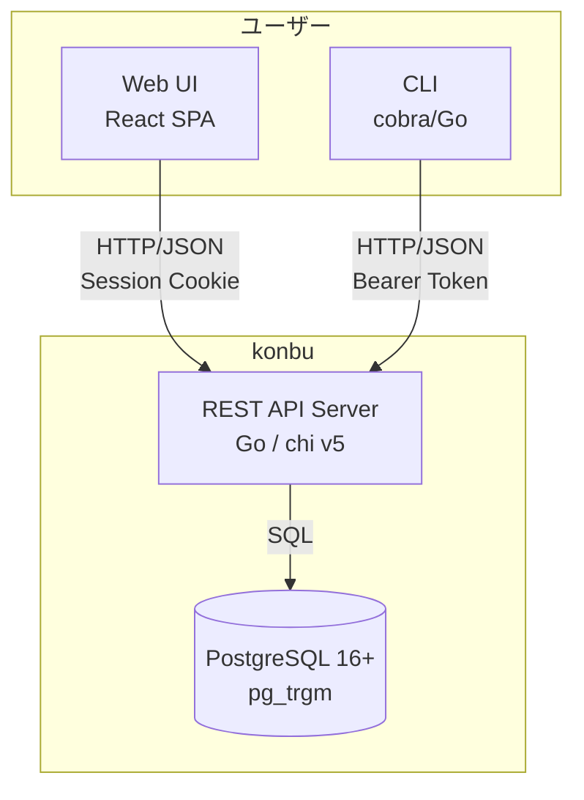

# プロジェクト概要

> **Status**: Active | 最終更新: 2026-03-17

本ドキュメントは、konbu全体を1枚で把握するための概要を記載する。

---

## 一言で言うと

konbuは、個人に散在する情報を一箇所に統合し、書き出した情報を保持・更新・再アクセスできる text-first workspace である。AIはその情報空間に対して動く代理人として、検索・整理・添削・操作を担う。セルフホスト（OSS・MIT）とクラウド版の2形態で提供する。

---

## 背景

| 項目 | 内容 |
|------|------|
| 現状の課題 | メモ・ToDo・カレンダー・ブックマークが別々のサービスに散らばり、「どこにあるか」を覚えるコストが発生する。Notionは重く、Obsidianは表現がMarkdownに寄りやすく、Google Calendarはデータを手元に置きづらい |
| 解決アプローチ | 「情報は1つ、UIは複数」を前提に、個人の情報を単一の空間に統合する。メモ・ToDo・予定・リンクを分断せず、REST API を窓口に Web UI・CLI・AI 代理操作を含むすべてのクライアントからアクセス可能にする |

---

## 主要機能

| 機能 | 説明 |
|------|------|
| Memos | Markdown/テーブル型のメモ。CodeMirror 6エディタ、タグ付き |
| ToDo | 期限・タグ・メモ付きタスク管理。完了/未完了のステータス操作 |
| Calendar | 月表示カレンダー。終日/時間指定、繰り返し予定、iCalインポート |
| Tools | ブックマークランチャー。カテゴリ分類、favicon自動取得、ヘルスチェック |
| Cross-search | メモ・ToDo・予定をまたいだ横断全文検索（pg_trgm） |
| AI Agent Chat | 情報空間を前提に、自然言語で検索・整理・添削・操作を委譲 |
| CLI | 全リソースのCRUD操作を備えたスタンドアロンCLIクライアント |
| Export/Import | JSON/Markdown ZIPエクスポート、iCalインポート |

---

## 設計思想

- **情報は1つ、UIは複数**: メモ、ToDo、予定、リンクは別製品ではなく、表現方法の違う同じ情報として扱う
- **頭の中ではなく外に置く**: 覚えるためのツールではなく、外部化して必要なときに再アクセスするためのツールとして設計する
- **書くことと見つけることを分けない**: 集積、更新、検索は1つのループとして成立している必要がある
- **text-first, not text-only**: 情報の中心はテキストだが、予定やタスクには専用UIを与える
- **AIは代理人である**: AIはプロダクトの主役ではなく、統合された情報空間を操作するための実行レイヤーとして設計する

---

## 対象ユーザー

| ユーザー種別 | 説明 | 主な利用シーン |
|--------------|------|----------------|
| クラウドユーザー | セットアップ不要で使いたい個人 | ブラウザからのメモ・タスク・予定管理 |
| セルフホスター | 自分のサーバーを持ち、データを手元に置きたい個人 | Docker等でのセルフホスト運用 |
| CLI/APIユーザー | ターミナルやスクリプトからデータにアクセスしたい開発者 | CLIでのメモ追加、AIエージェント連携 |

---

## 提供形態

| 形態 | ライセンス | 説明 |
|------|-----------|------|
| **Self-hosted** | OSS (MIT) | 全機能無料。Docker or ネイティブでセルフホスト |
| **Cloud** | SaaS | 無料で全機能利用可。GitHub Sponsors 支援者向けの追加特典あり |

## システム概観

---

## 関連ドキュメント

- [目的・解決する課題](./goals.md) - 課題一覧と成功基準の定義
- [principles.md](./principles.md) - 設計原則と判断基準
- [スコープ・対象外](./scope.md) - 対象範囲とフェーズ分割
- [システム境界・外部連携](../02-architecture/context.md) - システム境界と外部システム定義
