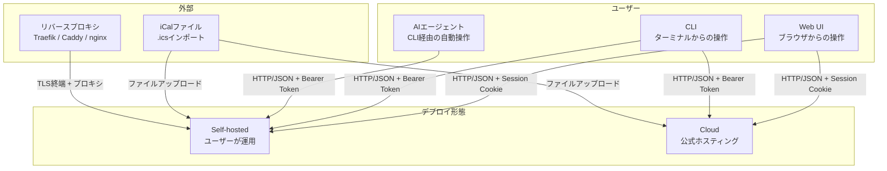

---
depends_on:
  - ../01-overview/summary.md
tags: [architecture, c4, context, boundary]
ai_summary: "konbuのシステム境界と外部連携を定義。セルフホスト完結型で外部サービス依存なし"
---

# システム境界・外部連携

> **Status**: Active | 最終更新: 2026-03-14

本ドキュメントは、konbuのシステム境界と外部システムとの連携を定義する。

---

## システムコンテキスト図

---

## デプロイ形態

| 形態 | 説明 | ライセンス |
|------|------|-----------|
| Self-hosted | ユーザーが自分のサーバーで運用。全機能利用可能 | OSS (MIT) |
| Cloud | 公式のホスティング環境。登録のみで利用開始。Sponsors 特典あり | SaaS |

コードベースは共通。Cloud 版固有の機能（プラン管理等）は将来的に別パッケージとして追加。

## アクター定義

| アクター | 種別 | 説明 | 主な操作 |
|----------|------|------|----------|
| Webユーザー | 人間 | ブラウザからkonbuを操作する個人 | メモ・ToDo・予定のCRUD、検索、エクスポート |
| CLIユーザー | 人間 | ターミナルからkonbu CLIを使う開発者 | 全リソースのCRUD、JSON出力 |
| AIエージェント | 外部システム | CLI (`--json`) 経由でkonbuのデータを操作するAI | タスク追加、メモ作成、検索 |

---

## 外部システム連携

### iCalインポート

| 項目 | 内容 |
|------|------|
| 概要 | RFC 5545準拠のiCalファイルからカレンダー予定を取り込む |
| 連携方式 | ファイルアップロード (multipart/form-data) |
| 連携データ | VEVENT（DTSTART/DTEND、RRULE対応） |
| 連携頻度 | ユーザー操作時のみ（手動） |
| 依存度 | オプション |

### リバースプロキシ

| 項目 | 内容 |
|------|------|
| 概要 | TLS終端とドメインルーティングを担当 |
| 連携方式 | HTTPリバースプロキシ |
| 連携データ | 全HTTPリクエスト/レスポンス |
| 連携頻度 | リアルタイム（全リクエスト） |
| 依存度 | 本番環境では必須、開発環境では不要 |

---

## システム境界

### 内部（konbuの責務）

| 責務 | 説明 |
|------|------|
| データ永続化 | PostgreSQLへの全リソースの保存・検索 |
| 認証・認可 | セッション認証 + APIキー認証 |
| REST API提供 | 全機能をHTTP/JSONで公開 |
| Web UI配信 | React SPAの静的ファイル配信（SPA fallback） |
| データエクスポート | JSON/Markdown ZIP形式でのデータ出力 |

### 外部（konbuの責務外）

| 項目 | 担当 | 説明 |
|------|------|------|
| TLS証明書管理 | リバースプロキシ | Let's Encrypt等による証明書取得・更新 |
| DNS | ドメイン管理サービス | ドメインのAレコード設定 |
| バックアップ | インフラ運用 | PostgreSQLのバックアップ・リストア |
| 監視 | インフラ運用 | サーバーの死活監視・アラート |

---

## 関連ドキュメント

- [summary.md](../01-overview/summary.md) - プロジェクト概要
- [structure.md](./structure.md) - 主要コンポーネント構成
