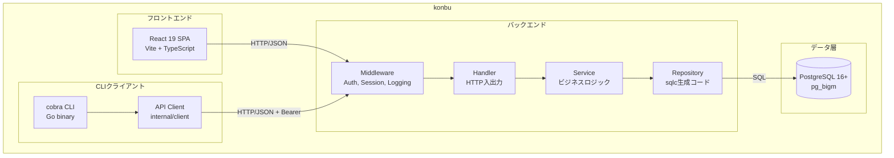

---
depends_on:
  - ./context.md
tags: [architecture, c4, container, components]
ai_summary: "konbuの主要コンポーネント構成 -- handler/service/repositoryの3層アーキテクチャとフロントエンド構成"
---

# 主要コンポーネント構成

> **Status**: Active | 最終更新: 2026-03-14

本ドキュメントは、konbuの主要コンポーネントとその関係を定義する。

---

## コンポーネント構成図



---

## コンポーネント一覧

| コンポーネント | 種別 | 責務 | 技術 |
|----------------|------|------|------|
| Web UI | フロントエンド | ブラウザからの操作UI | React 19, Vite, TypeScript, shadcn/ui, Zustand |
| Middleware | バックエンド | 認証・ログ・エラーハンドリング | Go, chi middleware |
| Handler | バックエンド | HTTP入出力、バリデーション、レスポンス整形 | Go, chi router |
| Service | バックエンド | ビジネスロジック、トランザクション管理 | Go |
| Repository | バックエンド | DBアクセス（sqlc生成コード + カスタムクエリ） | Go, sqlc |
| CLI | クライアント | ターミナルからの全リソースCRUD | Go, cobra |
| API Client | クライアント | CLI用HTTPクライアント | Go |
| PostgreSQL | データ | データ永続化、全文検索 | PostgreSQL 16+, pg_bigm |

---

## コンポーネント詳細

### Handler層

| 項目 | 内容 |
|------|------|
| 責務 | HTTP入出力のみ。バリデーション、レスポンス整形 |
| 技術 | Go / chi router |
| 入力 | HTTPリクエスト |
| 出力 | JSON レスポンス |
| 依存 | Service層（一方向） |

### Service層

| 項目 | 内容 |
|------|------|
| 責務 | ビジネスロジック。トランザクション管理、タグupsert |
| 技術 | Go |
| 入力 | 構造体（handlerから渡されるリクエストデータ） |
| 出力 | 構造体（レスポンスデータ or エラー） |
| 依存 | Repository層（一方向） |

### Repository層

| 項目 | 内容 |
|------|------|
| 責務 | DBアクセスのみ |
| 技術 | Go / sqlc生成コード |
| 入力 | SQLパラメータ |
| 出力 | DB行データ |
| 依存 | PostgreSQL |

---

## コンポーネント間通信

| 送信元 | 送信先 | プロトコル | 内容 |
|--------|--------|------------|------|
| Web UI | API Server | HTTP/JSON + Session Cookie | 全リソースのCRUD |
| CLI | API Server | HTTP/JSON + Bearer Token | 全リソースのCRUD |
| API Server | PostgreSQL | SQL (lib/pq) | データ永続化・検索 |

---

## モジュール一覧

| モジュール | handler | service | 機能 |
|-----------|---------|---------|------|
| auth | auth_handler | auth_service | ユーザー登録/ログイン/設定 |
| memo | memo_handler | memo_service | メモCRUD |
| todo | todo_handler | todo_service | ToDo CRUD、完了/未完了 |
| event | event_handler | event_service | カレンダー予定CRUD |
| tool | tool_handler | tool_service | ツールCRUD、favicon、ヘルスチェック |
| tag | tag_handler | tag_service | タグCRUD、暗黙的upsert |
| search | search_handler | search_service | 横断全文検索 |
| export | export_handler | export_service | JSON/Markdown ZIPエクスポート |
| import | import_handler | import_service | iCalインポート |

---

## ディレクトリ構成

```
konbu/
├── cmd/
│   ├── server/          # APIサーバーエントリポイント
│   └── konbu/           # CLIエントリポイント
├── internal/
│   ├── config/          # 環境変数
│   ├── handler/         # HTTPハンドラ
│   ├── middleware/       # 認証・ログ
│   ├── model/           # 構造体
│   ├── repository/      # DB (sqlc)
│   ├── service/         # ビジネスロジック
│   ├── client/          # APIクライアント (CLI用)
│   └── testutil/        # テスト用ヘルパー
├── sql/
│   ├── migrations/      # マイグレーション
│   └── queries/         # sqlcクエリ
├── web/frontend/        # React SPA
├── docker/              # Dockerfile
└── docs/                # 設計ドキュメント
```

---

## フロントエンド構成

```
web/frontend/src/
  pages/        ページコンポーネント（ルートごと）
  components/   共通UI (shadcn/ui)
  stores/       状態管理 (Zustand)
  lib/          APIクライアント、ユーティリティ
  i18n/         翻訳ファイル (en.json, ja.json)
```

Zustandでグローバル管理するのは `user`, `theme`, `sidebarOpen` のみ。ページ固有のデータはローカルstate。

---

## 関連ドキュメント

- [システム境界・外部連携](./context.md) - システム境界と外部システム定義
- [技術スタック](./tech-stack.md) - 技術選定と選定理由
- [データモデル](../03-details/data-model.md) - エンティティ定義とER図
- [API設計](../03-details/api.md) - APIエンドポイント仕様
- [UI設計](../03-details/ui.md) - 画面一覧と画面遷移
- [主要フロー](../03-details/flows.md) - 処理フローのシーケンス図
