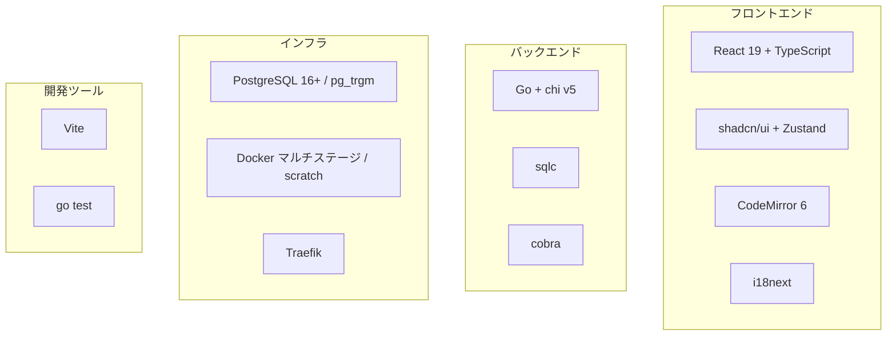

---
depends_on:
  - ./structure.md
tags: [architecture, technology, stack]
ai_summary: "konbuの技術スタック一覧と選定理由 -- Go/chi/sqlc/React/PostgreSQL/Docker"
---

# 技術スタック

> **Status**: Active | 最終更新: 2026-03-14

本ドキュメントは、konbuで使用する技術スタックとその選定理由を記載する。

---

## 技術スタック概要

---

## 技術スタック一覧

### 言語・フレームワーク

| カテゴリ | 技術 | バージョン | 用途 |
|----------|------|------------|------|
| バックエンド言語 | Go | 1.25+ | APIサーバー、CLI |
| ルーター | chi | v5 | HTTPルーティング、ミドルウェア |
| SQLコード生成 | sqlc | latest | SQL → Go型安全コード生成 |
| CLIフレームワーク | cobra | latest | CLIコマンド定義 |
| フロントエンド言語 | TypeScript | 5.x | Web UI |
| UIフレームワーク | React | 19 | SPA |
| ビルドツール | Vite | latest | フロントエンドビルド・HMR |

### UIライブラリ

| 技術 | 用途 |
|------|------|
| shadcn/ui | UIコンポーネント |
| Zustand | グローバル状態管理 |
| CodeMirror 6 (@uiw/react-codemirror) | Markdownエディタ |
| i18next / react-i18next | 国際化（日本語・英語） |

### データベース・ストレージ

| 技術 | バージョン | 用途 |
|------|------------|------|
| PostgreSQL | 16+ | データ永続化 |
| pg_trgm | built-in | trigram全文検索（ILIKE高速化） |
| pgcrypto | built-in | UUID生成 (gen_random_uuid) |

### インフラ・ホスティング

| 技術 | 用途 |
|------|------|
| Docker | マルチステージビルド、scratchベース最終イメージ |
| Docker Compose | 開発・本番環境のオーケストレーション |
| Traefik | 本番環境のリバースプロキシ、Let's Encrypt TLS |

---

## 技術選定理由

### Go (バックエンド)

| 項目 | 内容 |
|------|------|
| 選定理由 | シングルバイナリ、高速起動、標準ライブラリ充実、scratchイメージで最小コンテナ |
| 代替候補 | Node.js (Express), Rust (Axum) |
| 不採用理由 | Node.jsはランタイム依存でイメージが大きい。Rustはビルド時間と学習コスト |

### chi (ルーター)

| 項目 | 内容 |
|------|------|
| 選定理由 | net/http互換、ミドルウェアチェーン、軽量 |
| 代替候補 | Echo, Gin, 標準net/http |
| 不採用理由 | Echoは独自Context。Ginも同様。標準net/httpはルーティング機能が不足 |

### sqlc (DBアクセス)

| 項目 | 内容 |
|------|------|
| 選定理由 | 手書きSQLから型安全なGoコードを生成。SQLの自由度を維持しつつ型安全 |
| 代替候補 | GORM, sqlx |
| 不採用理由 | GORMはORM特有の抽象化漏れ。sqlxは型安全性が不足 |

### PostgreSQL + pg_trgm

| 項目 | 内容 |
|------|------|
| 選定理由 | JSONB、GINインデックス、pg_trgmでILIKE検索を高速化。マネージドDB（Supabase等）で利用可能 |
| 代替候補 | SQLite, MySQL |
| 不採用理由 | SQLiteはJSONBと全文検索の機能が限定的。MySQLは同等のtrigram検索がない |

### React + Vite

| 項目 | 内容 |
|------|------|
| 選定理由 | エコシステムの充実、shadcn/uiの利用可能性、Viteによる高速HMR |
| 代替候補 | Vue, Svelte, htmx |
| 不採用理由 | Vueはshadcn/ui非対応。SvelteはUIライブラリが少ない。htmxはSPAとして不十分 |

---

## 関連ドキュメント

- [structure.md](./structure.md) - 主要コンポーネント構成
