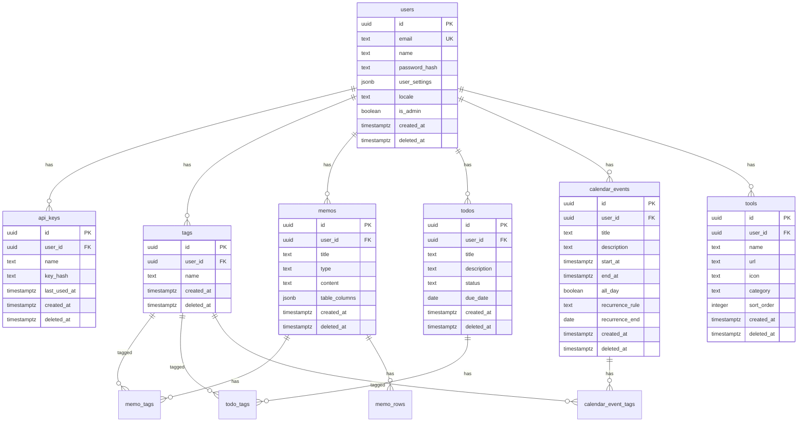

---
depends_on:
  - ../02-architecture/structure.md
tags: [details, data, er-diagram, schema]
ai_summary: "konbuのエンティティ定義・ER図・論理削除パターン・インデックス設計を定義"
---

# データモデル

> **Status**: Active | 最終更新: 2026-03-14

本ドキュメントは、konbuのデータモデルを定義する。完全なDDLは [schema.sql](../schema.sql) を参照。

---

## ER図

---

## エンティティ一覧

| エンティティ | 説明 | 主キー |
|--------------|------|--------|
| users | ユーザー（メール+パスワード認証） | UUID |
| api_keys | APIキー（Bearer認証用、SHA-256ハッシュ保存） | UUID |
| tags | タグ（ユーザーごと、(user_id, name) ユニーク） | UUID |
| memos | メモ（Markdown / テーブル型） | UUID |
| memo_tags | メモ-タグ中間テーブル | (memo_id, tag_id) |
| memo_rows | テーブル型メモの行データ（JSONB） | UUID |
| todos | ToDo（status: open/done） | UUID |
| todo_tags | ToDo-タグ中間テーブル | (todo_id, tag_id) |
| calendar_events | カレンダー予定（終日/時間指定、繰り返し対応） | UUID |
| calendar_event_tags | 予定-タグ中間テーブル | (event_id, tag_id) |
| tools | ツールランチャー（カテゴリ分類、並び順） | UUID |

---

## 論理削除パターン

全テーブルに `deleted_at TIMESTAMPTZ` カラムを持つ。

- DELETE APIは `deleted_at = now()` をセット
- 全SELECTクエリに `WHERE deleted_at IS NULL` を付与
- 物理削除は未実装（将来のゴミ箱機能で対応予定）

---

## タグの設計

- メモ・ToDo・予定の3リソースで共有
- 作成リクエストで存在しないタグ名を指定すると自動作成（暗黙的upsert）
- 中間テーブル（memo_tags, todo_tags, calendar_event_tags）で多対多
- service層でタグの付け替え（全削除 → 再挿入）を処理

---

## リレーション

| 親 | 子 | 関係 | 説明 |
|-----|-----|------|------|
| users | memos | 1:N | ユーザーごとのメモ |
| users | todos | 1:N | ユーザーごとのToDo |
| users | calendar_events | 1:N | ユーザーごとの予定 |
| users | tools | 1:N | ユーザーごとのツール |
| users | tags | 1:N | ユーザーごとのタグ |
| users | api_keys | 1:N | ユーザーごとのAPIキー |
| memos | memo_rows | 1:N | テーブル型メモの行データ |
| memos - tags | memo_tags | N:M | メモへのタグ付け |
| todos - tags | todo_tags | N:M | ToDoへのタグ付け |
| calendar_events - tags | calendar_event_tags | N:M | 予定へのタグ付け |

---

## インデックス

| テーブル | カラム | 種別 | 目的 |
|----------|--------|------|------|
| users | email | UNIQUE | メールアドレスの一意制約 |
| api_keys | user_id | INDEX (partial) | ユーザーごとのAPIキー検索 |
| tags | user_id | INDEX (partial) | ユーザーごとのタグ検索 |
| tags | (user_id, name) | UNIQUE | タグ名の一意制約 |
| memos | user_id | INDEX (partial) | ユーザーごとのメモ検索 |
| memos | (user_id, type) | INDEX (partial) | タイプ別フィルタ |
| memo_rows | (memo_id, sort_order) | INDEX (partial) | 行データの順序取得 |
| todos | user_id | INDEX (partial) | ユーザーごとのToDo検索 |
| todos | (user_id, status) | INDEX (partial) | ステータス別フィルタ |
| todos | (user_id, due_date) | INDEX (partial) | 期限順ソート |
| calendar_events | user_id | INDEX (partial) | ユーザーごとの予定検索 |
| calendar_events | (user_id, start_at) | INDEX (partial) | 日時範囲クエリ |
| tools | (user_id, sort_order) | INDEX (partial) | 並び順取得 |

全partial indexは `WHERE deleted_at IS NULL` 条件付き。

---

## 全文検索

pg_trgmを使ったtrigram全文検索。

| 対象 | 検索カラム |
|------|-----------|
| メモ | title + content |
| ToDo | title + description |
| 予定 | title + description |

`ILIKE`による部分一致検索をベースに、pg_trgmのGINインデックスで高速化。マネージドDB（Supabase, Neon, RDS等）で利用可能。

---

## 関連ドキュメント

- [structure.md](../02-architecture/structure.md) - 主要コンポーネント構成
- [api.md](./api.md) - API設計
