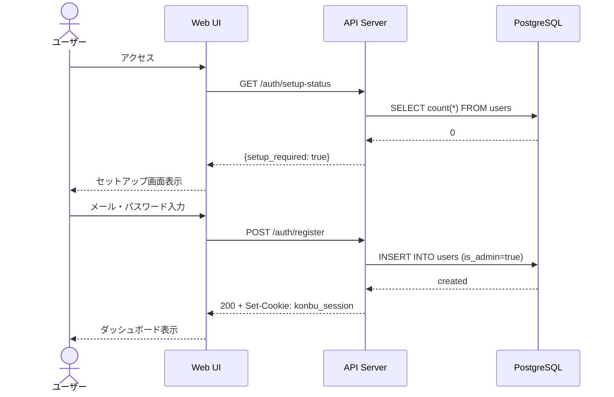
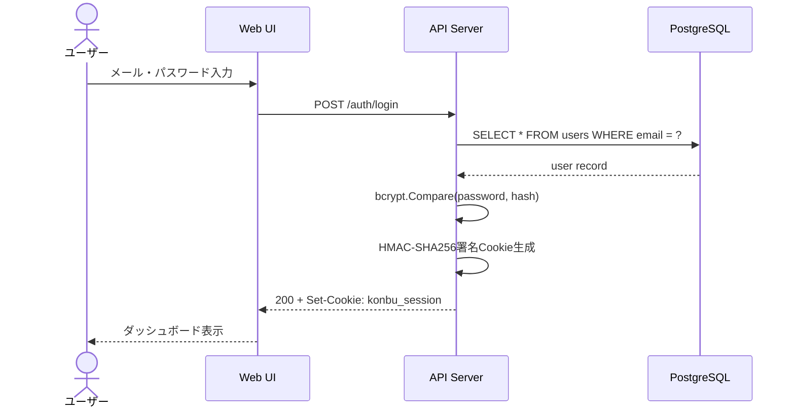
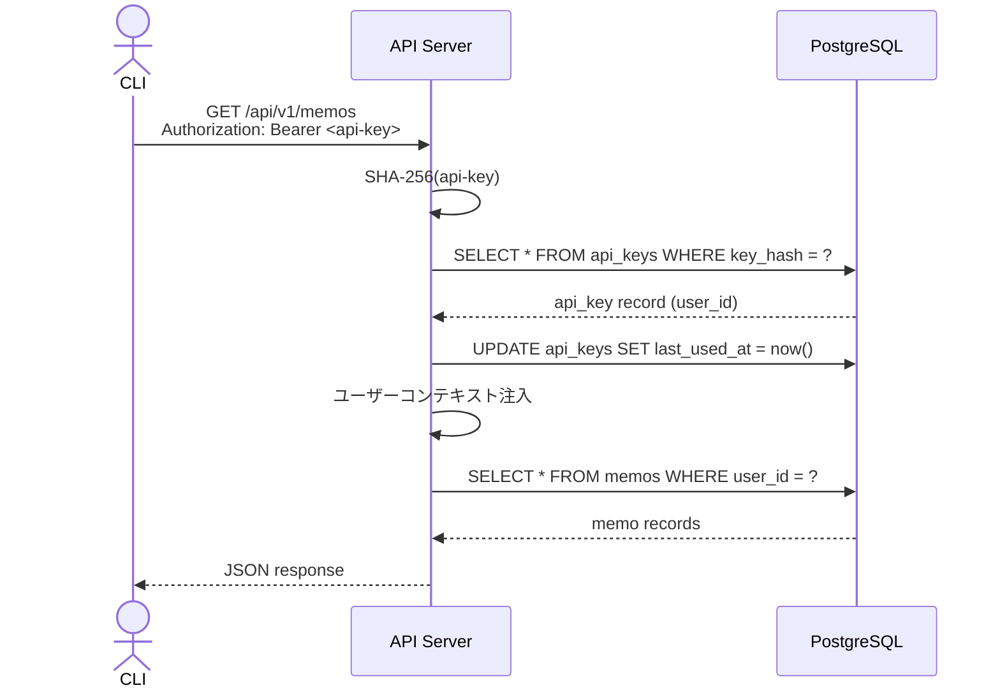
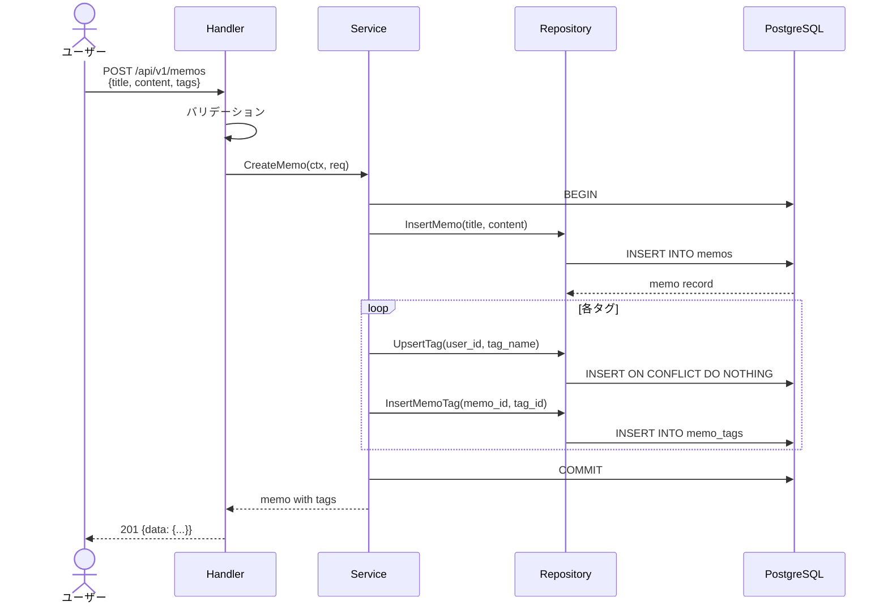
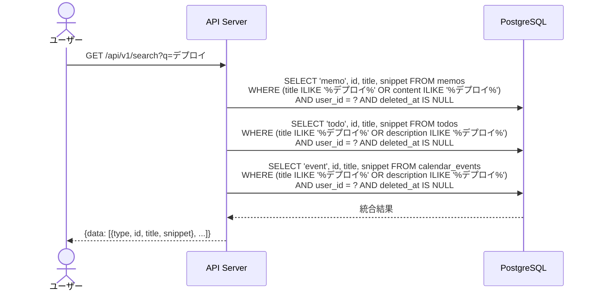

---
depends_on:
  - ../02-architecture/structure.md
tags: [details, flows, sequence, process]
ai_summary: "konbuの主要処理フロー -- 認証、リソースCRUD、横断検索のシーケンス図"
---

# 主要フロー

> **Status**: Active | 最終更新: 2026-03-14

本ドキュメントは、konbuの主要な処理フローを定義する。

---

## フロー一覧

| フローID | フロー名 | 説明 |
|----------|----------|------|
| F001 | 初期セットアップ | 初回起動時のアカウント作成 |
| F002 | ログイン認証 | Web UIからのセッション認証 |
| F003 | APIキー認証 | CLI/外部連携からのBearer認証 |
| F004 | リソースCRUD | メモ・ToDo・予定の作成（タグupsert含む） |
| F005 | 横断検索 | pg_trgmによる全リソース横断検索 |

---

## フロー詳細

### F001: 初期セットアップ

| 項目 | 内容 |
|------|------|
| 概要 | サーバー初回起動時、最初のユーザーを管理者として登録する |
| トリガー | ブラウザでkonbuにアクセス |
| アクター | 初回ユーザー |
| 前提条件 | usersテーブルが空 |
| 事後条件 | 管理者アカウントが作成され、セッションが発行される |

---

### F002: ログイン認証（Web UI）

| 項目 | 内容 |
|------|------|
| 概要 | メール+パスワードでログインし、HMAC署名セッションCookieを発行する |
| トリガー | ログイン画面でCredentials送信 |
| アクター | Webユーザー |

#### エラーケース

| エラー | 条件 | 対応 |
|--------|------|------|
| 認証失敗 | メールまたはパスワードが不一致 | 401 Unauthorized |
| ユーザー未登録 | メールアドレスが存在しない | 401 Unauthorized（同一メッセージ） |

---

### F003: APIキー認証（CLI）

| 項目 | 内容 |
|------|------|
| 概要 | Bearer tokenでAPIキーを照合し、ユーザーコンテキストを注入する |
| トリガー | CLIコマンド実行 |
| アクター | CLIユーザー / AIエージェント |

---

### F004: リソースCRUD（メモ作成例）

| 項目 | 内容 |
|------|------|
| 概要 | メモを作成し、タグの暗黙的upsertを行う |
| トリガー | Web UIまたはCLIからメモ作成リクエスト |
| アクター | 認証済みユーザー |

---

### F005: 横断検索

| 項目 | 内容 |
|------|------|
| 概要 | メモ・ToDo・予定をpg_trgm全文検索で横断的に検索する |
| トリガー | 検索クエリの入力 |
| アクター | 認証済みユーザー |

---

## 関連ドキュメント

- [data-model.md](./data-model.md) - データモデル
- [api.md](./api.md) - API設計
- [ui.md](./ui.md) - UI設計
