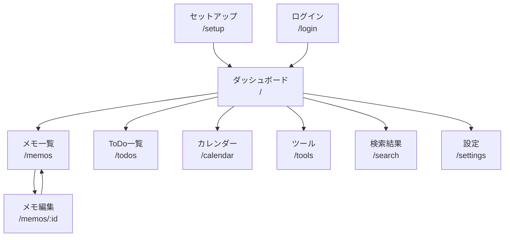

---
depends_on:
  - ../02-architecture/structure.md
  - ./flows.md
tags: [details, ui, screens, interactions]
ai_summary: "konbuのUI設計 -- 画面一覧・画面遷移・共通コンポーネント・状態管理"
---

# UI設計

> **Status**: Active | 最終更新: 2026-03-14

本ドキュメントは、konbuのUI設計を定義する。

---

## 画面一覧

| 画面ID | 画面名 | パス | 説明 |
|--------|--------|------|------|
| S001 | セットアップ | `/setup` | 初回起動時のアカウント作成 |
| S002 | ログイン | `/login` | メール+パスワード認証 |
| S003 | ダッシュボード | `/` | メモ・ToDo・カレンダー・ツールの統合ビュー |
| S004 | メモ一覧 | `/memos` | メモのリスト表示、検索・タグフィルタ |
| S005 | メモ編集 | `/memos/:id` | CodeMirror 6によるMarkdown編集 + プレビュー |
| S006 | ToDo一覧 | `/todos` | タスクリスト、ステータス切り替え |
| S007 | カレンダー | `/calendar` | 月表示、イベントCRUD |
| S008 | ツール | `/tools` | ブックマークランチャー、カテゴリ別表示 |
| S009 | 検索結果 | `/search` | 横断検索結果の表示 |
| S010 | 設定 | `/settings` | ユーザー設定、APIキー管理 |

---

## 画面遷移図

---

## 画面詳細

### S003: ダッシュボード

| 項目 | 内容 |
|------|------|
| パス | `/` |
| 目的 | ブラウザのスタートページとして、全機能への入口を提供 |
| アクセス権 | 認証済みユーザー |

#### 構成要素

| 要素 | 種別 | 説明 |
|------|------|------|
| サイドバー | ナビゲーション | ページ切り替え（折りたたみ可） |
| 検索バー | 入力 | 横断検索へのクイックアクセス |
| ウィジェット | リスト | メモ・ToDo・予定のサマリー表示 |

### S005: メモ編集

| 項目 | 内容 |
|------|------|
| パス | `/memos/:id` |
| 目的 | Markdownメモの編集とプレビュー |
| アクセス権 | 認証済みユーザー（自分のメモのみ） |

#### 構成要素

| 要素 | 種別 | 説明 |
|------|------|------|
| タイトル入力 | テキスト | メモのタイトル編集 |
| CodeMirrorエディタ | エディタ | Markdownテキスト編集 |
| プレビューパネル | 表示 | Markdownレンダリング結果 |
| タグ選択 | タグ入力 | 既存タグ選択 or 新規タグ作成 |

---

## 共通コンポーネント

| コンポーネント | 説明 | 使用画面 |
|----------------|------|----------|
| サイドバー | ページナビゲーション、折りたたみ対応 | 全画面（認証後） |
| 検索バー | 横断検索入力 | 全画面（認証後） |
| タグバッジ | タグの表示・フィルタ | メモ・ToDo・カレンダー |
| 確認ダイアログ | 削除等の破壊的操作の確認 | 全画面 |

---

## 状態管理

Zustand storeでグローバル管理する状態:

| store | 管理対象 | 説明 |
|-------|----------|------|
| user | ユーザー情報 | ログイン状態、名前、メール |
| theme | テーマ設定 | ライト/ダーク |
| sidebarOpen | サイドバー状態 | 開閉状態 |

ページ固有のデータ（メモ一覧、ToDo一覧等）はローカルstateで管理する。

---

## 国際化

i18next / react-i18nextで日本語・英語に対応。翻訳ファイルは `web/frontend/src/i18n/` に配置。

---

## 関連ドキュメント

- [flows.md](./flows.md) - 主要フロー
- [structure.md](../02-architecture/structure.md) - コンポーネント構成
