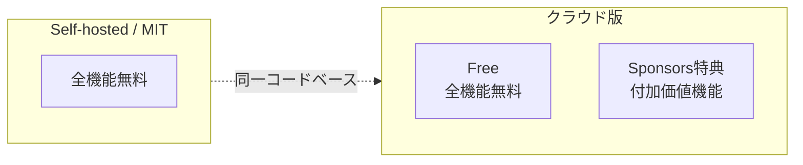
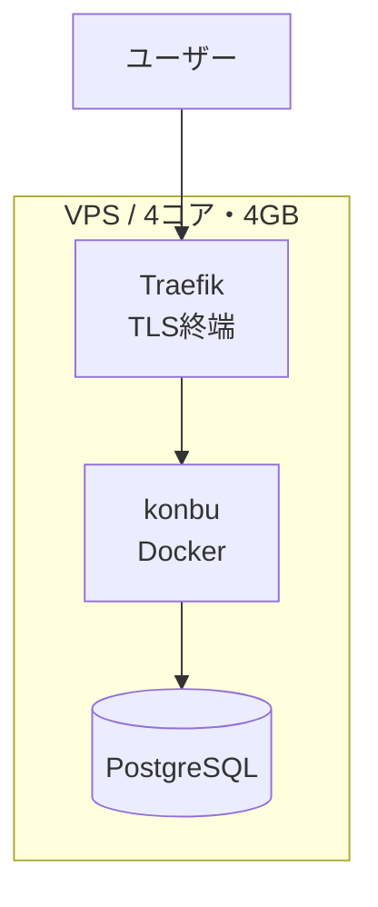

---
depends_on:
  - ../01-overview/scope.md
  - ../02-architecture/context.md
tags: [hosting, saas, pricing, infrastructure]
ai_summary: "konbuの提供形態・料金モデル・Sponsors特典・インフラ構成を定義"
---

# 提供形態

> **Status**: Active | 最終更新: 2026-03-14

本ドキュメントは、konbuの提供形態と料金モデルを定義する。

---

## 提供形態の概要

konbuは **Open Core (MIT)** モデルで提供する。

---

## 料金モデル

| 形態 | コスト | 機能 | 対象 |
|------|--------|------|------|
| **Self-hosted** | 無料 | 全機能 | サーバーを自分で運用できる人 |
| **Cloud Free** | 無料 | 全機能 | セットアップ不要で使いたい人 |
| **Cloud Sponsors** | GitHub Sponsors 支援 | 全機能 + 特典 | プロジェクトを支援したい人 |

### 設計方針

- 機能制限・容量制限で課金しない
- Free で全機能が不自由なく使える
- Sponsors 特典は「あると便利」な付加価値
- エクスポートは全層で開放（ロックイン感を出さない）

---

## Sponsors 特典（候補）

| 特典 | 説明 |
|------|------|
| API キー発行 | CLI 経由でのデータ操作 |
| 共有リンク | メモを閲覧専用の共有 URL 化 |
| カスタムテーマ | UI のカスタマイズ |
| 自動バックアップ | 日次の自動エクスポート |
| Sponsors バッジ | プロフィールに支援者マーク表示 |

非エンジニアがメインターゲットのため、CLI/API は Sponsors 特典に含めても Free 層への影響は小さい。

---

## 収益モデル

| 項目 | 内容 |
|------|------|
| 収益源 | GitHub Sponsors による支援（寄付） |
| 法的位置づけ | 対価性のない寄付（特商法の適用外） |
| 税務 | 雑所得（年間20万円以下なら確定申告不要） |
| 決済システム | 不要（GitHub が処理） |

---

## インフラ構成

### 初期フェーズ

| 項目 | 内容 |
|------|------|
| サーバー | VPS（既存インフラ活用） |
| コンテナ | Docker Compose |
| リバースプロキシ | Traefik（自動 HTTPS） |
| DB | PostgreSQL 16+ (pg_trgm) |
| バックアップ | pg_dump による定期バックアップ |

### スケールアウト（将来）

ユーザー数の増加に応じて段階的にスケール。

| ユーザー規模 | 対応 |
|-------------|------|
| ~100人 | 単一 VPS で十分 |
| ~1,000人 | DB を専用サーバーに分離 |
| 1,000人~ | アプリサーバーの水平スケール |

---

## 関連ドキュメント

- [scope.md](../01-overview/scope.md) - スコープ・対象外
- [context.md](../02-architecture/context.md) - システム境界・外部連携
